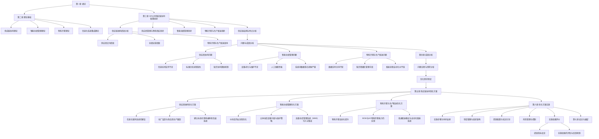

```mermaid
graph TD
    A[第一章 绪论] --> B[第二章 理论基础]
    A --> C[第三章 GR公司供应链协同管理现状]
    B --> D[供应链协同理论]
    B --> E[智能仓储管理理论]
    B --> F[物料齐套理论]
    B --> G[信息化系统集成理论]
    C --> H[供应链结构与特点分析]
    C --> I[供应商管理与物料供应现状]
    C --> J[智能仓储管理现状]
    C --> K[物料齐套与生产配送现状]
    C --> L[供应链协同绩效分析]
    L --> L1[供应商交付绩效]
    L --> L2[仓储运营绩效]
    L --> L3[物料齐套与生产配送效率]
    H --> M[问题与成因分析]
    M --> N[供应商协同问题]
    M --> O[智能仓储管理问题]
    M --> P[物料齐套与生产配送问题]
    N --> Q[信息技术支持不足]
    N --> R[标准化和流程缺失]
    N --> S[缺乏协同激励机制]
    O --> T[设备老化与维护不足]
    O --> U[人工依赖性强]
    O --> V[系统间数据孤岛现象严重]
    P --> W[数据实时共享不足]
    P --> X[缺乏精细化管理手段]
    P --> Y[配送流程自动化水平低]
    M --> Z[第四章 成因分析]
    Z --> Z1[问题诊断与需求分析]
    Z1 --> Z2[优化需求界定]
    Z2 --> AA[第五章 供应链协同优化方案]
    AA --> AB[供应商协同优化方案]
    AA --> AC[智能仓储管理优化方案]
    AA --> AD[物料齐套与生产配送优化方案]
    AB --> AE[信息化赋码系统的建设]
    AB --> AF[驻厂监造与供应商生产跟踪]
    AB --> AG[建立标准化物料编码和包装系统]
    AC --> AH[中央库作业流程优化]
    AC --> AI[立体仓库设备升级与维护策略]
    AC --> AJ[高级仓库管理系统（WMS）引入与集成]
    AD --> AK[物料齐套自动化提升]
    AD --> AL[BOM与AO物料齐套能力的实现]
    AD --> AM[改进配送模式与自动化配送系统]
    AA --> AN[第六章 优化方案实施]
    AN --> AO[实施步骤与时间安排]
    AN --> AP[项目管理与组织架构]
    AN --> AQ[资源配置与培训计划]
    AN --> AR[风险管理与控制]
    AN --> AS[实施效果评价]
    AS --> AT[绩效指标设定]
    AS --> AU[实施效果的评估与反馈机制]
    AN --> AV[第七章 结论与展望]

```