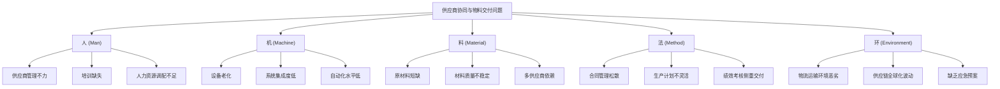

```mermaid
graph TD
    A["供应商协同与物料交付问题"] --> B1["人 (Man)"]
    A --> B2["机 (Machine)"]
    A --> B3["料 (Material)"]
    A --> B4["法 (Method)"]
    A --> B5["环 (Environment)"]

    B1 --> C1["供应商管理不力"]
    B1 --> C2["培训缺失"]
    B1 --> C3["人力资源调配不足"]
    
    B2 --> D1["设备老化"]
    B2 --> D2["系统集成度低"]
    B2 --> D3["自动化水平低"]
    
    B3 --> E1["原材料短缺"]
    B3 --> E2["材料质量不稳定"]
    B3 --> E3["多供应商依赖"]
    
    B4 --> F1["合同管理松散"]
    B4 --> F2["生产计划不灵活"]
    B4 --> F3["绩效考核侧重交付"]
    
    B5 --> G1["物流运输环境恶劣"]
    B5 --> G2["供应链全球化波动"]
    B5 --> G3["缺乏应急预案"]


```